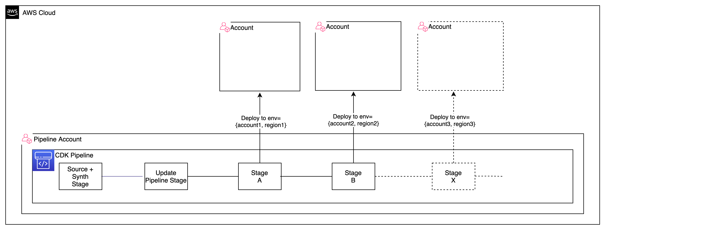
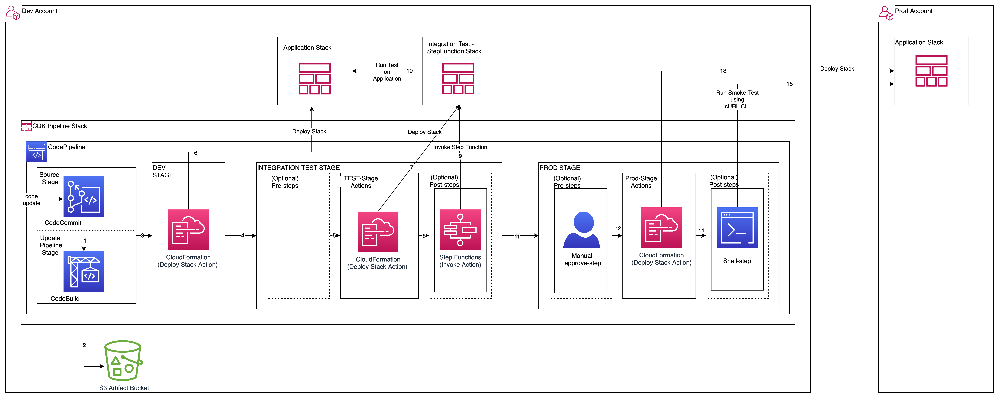
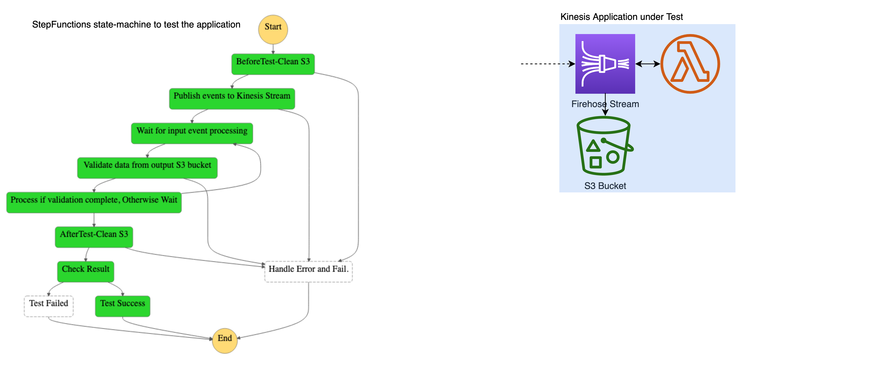

# CDK Pipeline integration with AWS Step Functions
    This project contains Typescript CDK for a CodePipeline stack implemented using the CDK-Pipelines(aws-cdk/pipelines) construct. 
    Pipeline and Stage objects are used to build a self-configuring pipeline which deploys and tests a sample application by invoking a Step Functions workflow.
    CDK-Pipelines simplifies the CI/CD of applications using CodePipeline by updating the pipeline and the stacks deployed by the pipeline
    in a single commit.

## Architecture
* ### Generic CDK Pipeline with mutliple Stages


* ### Sample CDK Pipeline deploying to DEV and PROD accounts 


* ### Integration Test using StepFunctions state machine:

  * The sample IntegrationTest stack deployed contains a Step Functions workflow which generates input data for the firehose stream and validate the output data.
  The execution steps are performed by Lambda functions defined using Boto3 (Python SDK for AWS).
  
  * The sample application stack contains a Firehose stream with a Lambda processor and S3 destination.
    This pattern can be used to test an application/infrastructure stack by defining the appropriate Step Function workflow in the IntegrationTest stack.



## Steps to deploy the CDK Pipeline

* ### Pre-requisites
    * Install AWS CLI, Git, Node.js, TypeScript
    * Install AWS CDK v1.120 (For later versions, you can update the package.json)
    * 2 AWS accounts are required - (to be used as Dev and Prod accounts)
    * IAM user with HTTPS Git credentials for CodeCommit in Dev Account
      <br/>

* ### Product versions
    * AWS CDK V1.120
    * AWS SDK for Python (Boto3) V1.18
    * Python 3.7+
    * Node.js 14, TypeScript V3.9
<br/>

* ### Create named profiles, bootstrap target environments

```shell
# Configure aws named-profiles for dev and prod environments
aws configure --profile dev
aws configure --profile prod

# Add following snippet to cdk.json
{
  // ...
  "context": {
    "@aws-cdk/core:newStyleStackSynthesis": true
  }
}

# bootstrap DEV environment for provisioning the pipeline:
env CDK_NEW_BOOTSTRAP=1 npx cdk bootstrap \
    --profile dev \
    --cloudformation-execution-policies arn:aws:iam::aws:policy/AdministratorAccess \
    aws://111111111111/us-west-2

# bootstrap PROD environment for deploying CDK applications into using a pipeline in account 111111111111:
env CDK_NEW_BOOTSTRAP=1 npx cdk bootstrap \
    --profile prod \
    --cloudformation-execution-policies arn:aws:iam::aws:policy/AdministratorAccess \
    --trust 11111111111 aws://222222222222/us-west-2

# Clone repository
git clone https://gitlab.aws.dev/pipeline/aws-mutating-cdkpipeline-gitlab
cd aws-mutating-cdkpipeline-gitlab

# Install NodeJS dependencies
npm i

# Create CodeCommit repository
aws code-commit create-repository aws-mutating-cdkpipeline-cc --profile dev

# Note the CodeCommit repository url from the command output

```

* ### Deploy pipeline stack
```shell
# Create CodePipeline
cdk deploy CdkPipelineStack --profile dev

```
* ### Upload code to CodeCommit repository and trigger the pipeline
```shell
# Re-initialize current git repository to push code to the CodeCommit repository
rm -rf .git
git init  
git branch -m main # Optional if default branch is already main

# Set remote origin, use the CodeCommit url from the stack outputs of the CodePipeline stack
git remote add origin https://git-codecommit.us-west-2.amazonaws.com/v1/repos/aws-mutating-cdkpipeline-cc

# Commit and Push code
git add -A && git commit -m "initial commit"
git push -u origin main

# Provide the HTTPS credentials for the CodeCommit repository IAM user
# The pipeline should start executing. Monitor pipeline execution from the AWS Console for CodePipeline

```
* ### Add additional stages and update the pipeline
```shell
# Add Integration Test stage
git add . ; git commit -m "add integ-test stage"
git push
```
## License

This library is licensed under the MIT-0 License. See the LICENSE file.